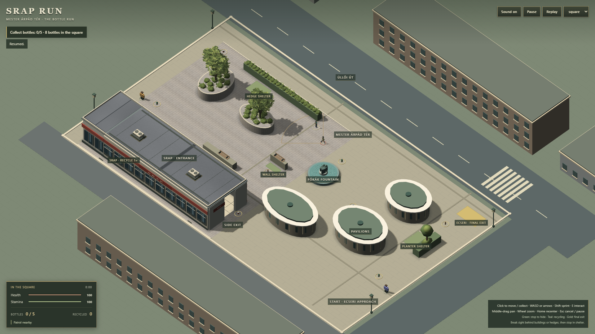

# G4 — final slice convergence

2026-09-22 · baseline `650aef9` · `codex/g3-production-art`.

**TECHNICAL: PASS · VISUAL: STILL WEAK · PERFORMANCE: PASS relative to G3.**

Stopping condition **B**. The slice is noticeably more coherent, but is **not yet
suitable as the map-production template**. Further repetitions of this geometric
kit are unlikely to reach the requested authored semi-realistic target. The single
dominant limitation is **generic architectural surface authoring**: clean repeated
atlas panels and largely uniform material response still lack the local surface,
recess and reflected-light information of site-specific baked/painted assets.
A different surface-asset strategy is needed before another detail pass or rollout.
This is an art judgement from matched gameplay frames, not a demonstrated engine
limit or a requirement to buy assets.

## Matched visual evidence

| G3 before | G4 after |
| --- | --- |
|  |  |

Both captures: 1920 × 1080, DPR 1, fixed gameplay heading, span 64, same scene
state and player placement. Committed images preserve the review alongside code.
The [local gallery](../evidence/g4/index.html) also includes matched span-32
pavilion approach views, wide/span-76, greyscale, proxy overlay, 1366 × 768,
SRAP/pavilion cutaway captures and a court/pavilion travel clip.

Retained changes:

- Three pavilions: smooth oval layered eaves, shallow shaped metal roofs,
  standing seams, flashed rooflights, continuous opaque glazing, structural
  mullions and bronze service bays. Exact gameplay proxies/canopy extents and
  original independent cutaway groups remain; low solid bases stay visible.
- One shared façade family on the two visible housing blocks and visible
  unbranded commercial shell: framed window/curtain rhythm, selected balcony
  stacks, recessed-looking entrances, plinths and parapets. Repeated modules and
  one atlas replace independent window objects/materials. BIF/Posta unchanged.
- Grounding through pavilion canopy shadows in the existing sun map, dark
  structural recesses, plinth contrast and the retained G3 contact strips.
  Sun/fill, shadow-map resolution, actors, G3 court, paving, trees and SRAP unchanged.

The first candidate's oversized housing roof seam pattern was rejected and
replaced with quieter roof material and narrow structural joints. Glass values
were lifted after inspection in shade. Normal and closer gameplay comparisons
show stronger architecture, but still reveal the material limitation above.
No isolated-asset render was used to award approval.

## Provenance and resource boundary

All G4 geometry and atlas artwork are original project work, authored in
[src/architecture.ts](../src/architecture.ts). No downloads, copied reference
artwork, paid assets or new dependencies. [Editable source card](../assets-source/g4/README.md).
Existing hero, watcher and G3 court binaries remain byte-identical to the baseline;
their established provenance is unchanged.

Six architectural region meshes share one opaque StandardMaterial and one 1024²
mipmapped atlas (~5.33 MiB additional uncompressed colour-texture storage).
Pavilions have 1,596 triangles each. No alpha stacks, reflection render targets,
normal maps or additional postprocessing. Background shells neither cast into nor sample the existing 1024 shadow map, preserving the original scenic shells' selective shadow behavior. Scene disposal owns all added resources.
Final scene: 240 meshes / 126 materials versus G3's 255 / 129; these lifecycle
counts are not GPU draw-call measurements.

## Technical verification

- Final `npm run build` / TypeScript: PASS. Existing large-chunk warning remains.
- Final `npm test`: **34/34 PASS**. New geometry check covers pavilion canopy
  bounds, valid buffers, low-base clearance and the bounded triangle count.
- Production Chrome suite: **19/19 PASS**. After the final commercial-family
  extension: **3/3 affected checks PASS** (architecture, actor/court integration,
  full alternate mission/doorways/replay).
- Each pavilion cuts away and reappears with its correct owner; unchanged solids
  still block LOS. Three resets retain the same resource counts: two skeletons,
  six animation groups, one navmesh/input adapter/scene, 240 meshes/126 materials.
- Captured G3/G4 SceneDefinitions are exactly equal; capture page errors: none.
  `square.ts`, gameplay, navigation, camera, input, hero/hostile sources and all
  existing public asset binaries are unchanged from `650aef9`.
- No gameplay, mission, item position, hiding, threat, camera, playable-area or
  population changes. No map-wide rollout, purchase, push or deployment.

## Matched performance

Chrome 153.0.8010.48 / Intel UHD ANGLE D3D11, headless, 1920 × 1080, DPR 1,
span 64. Same G3 procedure: 4 s warm-up, 12 s per idle/walk/sprint-exhaustion/court
phase; G3 → G4 → G3 → G4. No builds, captures or browser tests during sampling.

| Phase | G3 median, repeats (ms) | G4 median (ms) | G3 p95 (ms) | G4 p95 (ms) |
| --- | --- | --- | --- | --- |
| Idle | 10.3 / 10.2 | 10.7 / 10.7 | 14.4 / 14.4 | 14.5 / 14.5 |
| Walk | 10.4 / 10.2 | 10.7 / 10.7 | 14.0 / 14.2 | 14.1 / 13.2 |
| Sprint/exhaustion | 10.4 / 10.2 | 11.0 / 10.7 | 14.7 / 13.7 | 14.7 / 14.2 |
| Court travel | 10.2 / 10.0 | 10.4 / 10.4 | 15.3 / 14.0 | 14.2 / 14.5 |

Final medians are approximately **2–6% higher**; p95 changes range from **7% lower
to 4% higher**. This stays inside the inherited approximate 10% review envelope,
with no material regression under this procedure. It is not an exact-parity or
speedup claim. **All 16 segments: zero >100 ms stalls and zero dropped steps.**

The first candidate triggered a bounded investigation: median increases near
8–10% and p95 increases up to ~11%. Two corrections remain confined to G4:
normal face culling for opaque architecture, and restoring non-receiving scenic
shells instead of sampling the shadow map over distant roofs/walls. Pavilion
shadow/contact quality remains. No G3 court, foliage, global lighting or broad
optimisation work was reopened.

Three fresh-replay court samples: median **10.2 / 10.3 / 10.3 ms**, p95
**15.7 / 14.7 / 14.9 ms**. Zero stalls/dropped steps; resource counts remain
identical. No progressive degradation is observed. Each reset has its own
4 s warm-up before the 12 s travel sample; loading is excluded from travel timing.

Local startup-to-ready: G3 **1.209 / 1.524 s**, G4 **1.743 / 1.621 s**.
The first G4 load is slower; two warm-machine samples do not establish a precise
cold-start/network cost. Startup is reported separately from rendering.

Headless intervals retain the historical headed/G1 parity limitation. These
results do not certify headed 60 FPS or all hardware. The committed
[measurement summary](art/g4/metrics.json) preserves environment and raw selected
metrics; full snapshots and the initial candidate comparison remain in local
`evidence/g4/performance-final.json` and `performance-two-sided.json`.

## Reproduction

Save the built `650aef9` production output as `evidence/g4/g3-dist`, then build G4.
Run `node scripts/g4-review.mjs`, `node scripts/g4-motion.mjs`, and separately
`node scripts/g4-performance.mjs`. The latter uses the existing G3 matched
procedure against G3/G4 only and appends three isolated replay travel samples.
Do not run builds, captures or browser tests during timing.

Raw evidence/logs live under `evidence/g4` (ignored locally). The paired normal
captures are committed under `docs/art/g4`. Pre-existing AGENTS.md edits and
untracked design-guide/reference files are preserved outside the G4 checkpoint.
