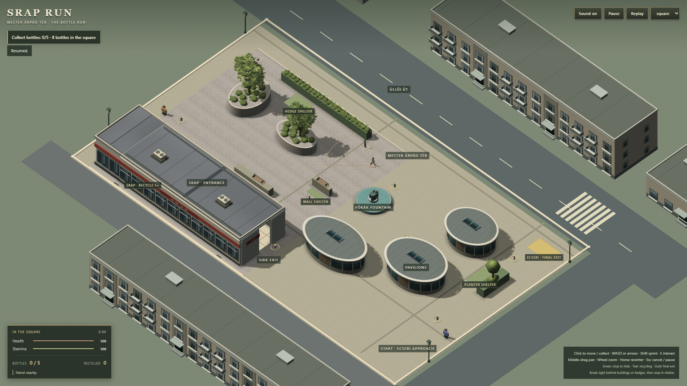
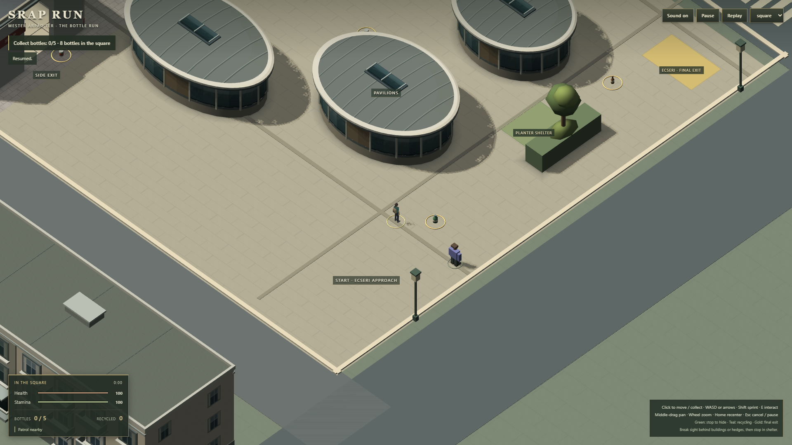

# G5 — authored surface checkpoint

2026-09-22 · baseline **b465c29** · branch **codex/g3-production-art**.

**TECHNICAL: PASS · VISUAL: WEAK · PERFORMANCE: PASS (bounded G4 comparison).**

Three substantial visual iterations completed; stopping at the requested bounded
budget checkpoint. Exact development-credit consumption was not instrumented.
The scene has better surface coherence but remains **VISUAL: WEAK** against the
semi-realistic target. This is not final art approval.

## Visible result

| G4 | G5 |
| --- | --- |
|  |  |
|  |  |

Matched 1920×1080 DPR1 gameplay captures, original heading and positions, span64
normal / span32 pavilion approach. Wide, greyscale, proxy, 1366×768, cutaway and
travel/pause/recenter footage are retained locally under `evidence/g5`.

1. **SRAP/pavilion surfaces:** one painted atlas supplies metal, plaster,
   local edge darkening, curtain folds and opaque glass reflections. SRAP uses
   the same atlas on existing buffers, with a restrained glass highlight.
   The initial cloudy roof treatment was rejected, not shipped.
2. **Roofs and square:** separate quieter zinc/felt regions, membrane repairs,
   and continuation of the existing licensed paving through central and pavilion
   routes. The abrupt east-court material boundary is removed without new ground
   geometry or changes to the interior/interaction surfaces.
3. **Integration:** existing SRAP end walls, west planter and cover bases gain
   plaster/cladding, darker lower contact values and muted top faces. Housing
   uses warmer/cooler façade bands, varied pane values and mirrored curtains.

No additional triangles, world objects, texture resolutions, shadows or
postprocessing. Mesh count remains **240**; materials **126 → 127**. The additional
glass material shares the existing-size atlas. Geometry buffers are made unique
only where visible proxy clones need UV/colour edits.

## Provenance

[Original source card](../assets-source/g5/README.md). The atlas is deterministic
original Canvas2D artwork in `src/surface-atlas.ts`, replacing G4's 1024² atlas.
Paving reuses G3's unchanged CC0 Concrete Tiles 02 (Charlotte Baglioni / Poly Haven).
No downloads, purchases, image-generation outputs or reference pixels are used as
runtime assets. All existing public asset bytes, including both actors, remain
unchanged. Material appearance is painted diffuse information plus one glass
specular response; this is not a new PBR roughness or baked-GI pipeline.

## Verification

- `npm run build`: TypeScript + production build PASS; existing large-chunk warning.
- `npm test`: **34/34 PASS** across nine unit/asset files.
- `node scripts/g5-verify.mjs`: **8/8 production Chrome checks PASS** across
  architecture, slice, M4, input-browser and world-depth. Includes full alternate
  five-item mission, SRAP doorway/recycling, Ecseri exit, LOS, actor pause and replay.
- `node scripts/g5-review.mjs`: G4/G5 SceneDefinitions exactly equal, no page errors.
- `node scripts/g5-motion.mjs`: travel, sprint, pause, cutaway and recenter capture.
- Three browser-test replays retain 240 meshes, 127 materials, two skeletons,
  six animation groups and one scene/navmesh/input adapter.
- Only presentation sources changed. Gameplay, navigation, item data, controls,
  camera, hero/hostile sources and public binaries match b465c29.

An initial unready DynamicTexture clone blocked startup; replacing cloning with
explicit texture sharing resolved it. All final checks above use the correction.

## Matched performance

**PERFORMANCE: PASS for the bounded G4 comparison**, with an unreproduced stall
outlier retained below. This does not certify all hardware or headed 60 FPS.
Chrome 153.0.8010.48, Intel UHD ANGLE D3D11, headless, 1920x1080 DPR1/span64;
4 s warm-up, 12 s each phase, G4/G5 alternating twice, no concurrent captures,
builds or browser tests.

| Phase | G4 median repeats | G5 median repeats | G4 p95 repeats | G5 p95 repeats |
| --- | --- | --- | --- | --- |
| Idle | 14.7 / 14.7 | 15.3 / 15.0 | 18.0 / 18.1 | 18.2 / 17.9 |
| Walk | 14.9 / 14.4 | 14.7 / 10.1 | 18.2 / 18.0 | 17.8 / 17.5 |
| Sprint | 14.2 / 14.3 | 14.8 / 9.9 | 17.9 / 18.0 | 18.1 / 10.7 |
| Court | 13.9 / 14.0 | 14.0 / 9.7 | 17.8 / 18.0 | 17.7 / 11.6 |

Milliseconds. First-pair median differences range from -1.3% to +4.2%; no
meaningful repeatable median/p95 regression is shown. Timing shifted sharply
during the second G5 run; the lower figures are **not evidence of a speedup**.
That run's court segment had **3 >100 ms stalls, worst 951.4 ms, 56 dropped
steps**. The other 15 matched segments had zero stalls/dropped steps.

Investigation: repeat only court travel, unchanged builds and settings, twice
per version. **G4 median 9.8/9.8 ms, p95 12.1/11.9; G5 median 9.6/9.6 ms,
p95 11.8/11.9.** All four confirmation segments had zero >100 ms stalls and zero
dropped steps. The outlier was not reproduced; its cause remains unestablished.
No speculative optimisation was applied or failed sample silently discarded.

The original three replay samples were 9.7/9.7/9.7 ms median, p95 12.0/11.9/11.8,
with zero stalls/dropped steps and identical resources. Confirmation replay
results are retained in the committed metrics file. No progressive degradation.
Startup-to-ready: G4 1.197/1.114 s vs G5 .854/.942 s in the full run; confirmation
G4 1.146/1.137 s vs G5 .743/1.335 s. These are warm-machine local observations,
not a cold-load speedup claim.

[Committed metrics](art/g5/metrics.json) include all initial samples, the outlier,
confirmation and replay results. Raw snapshots: evidence/g5/performance-final.json
and evidence/g5/confirmation/. Repeat the focused investigation with
`G2_PHASES=court G5_OUTPUT=evidence/g5/confirmation` (set as environment variables)
and `node scripts/g5-performance.mjs`.

## Remaining visual boundary

Still too generic: repetitive architecture, sparse prop/context density, simple
western tree/hedge shapes, plain immediately visible SRAP interior and dark
pavilion fronts. Surface work helps but does not reproduce the reference's
site-specific composition, material depth or vegetation richness.

Further focused visual work has high expected value; another blanket procedural
noise pass does not. BIF/background landmarks, richer interior authoring, foliage
silhouettes and furniture/collectible refinement were deliberately deferred at
the three-iteration checkpoint. Actors, new ambience systems, traffic, weather,
AI, district expansion and gameplay changes were also deferred as requested.

No push/deployment. Pre-existing AGENTS.md modifications and untracked supplied
design/reference files remain untouched and outside this checkpoint.

Reproduction: preserve b465c29 production build as `evidence/g5/g4-dist`, then
build current sources. Run the review/motion/verification scripts above and,
separately, `node scripts/g5-performance.mjs`. Do not run rendering tests or builds
during timing. First two candidate capture sets remain in iteration-1/iteration-2.
