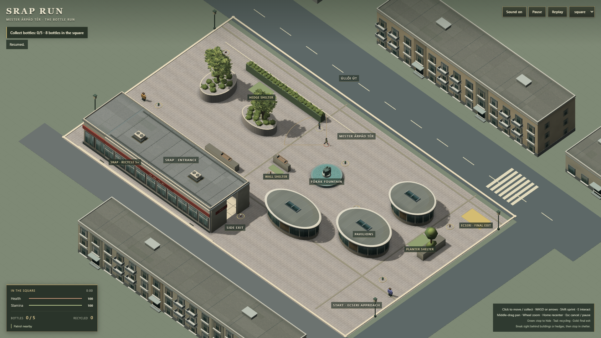
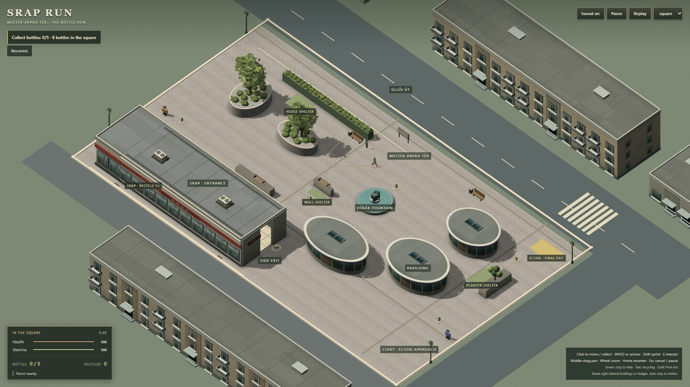
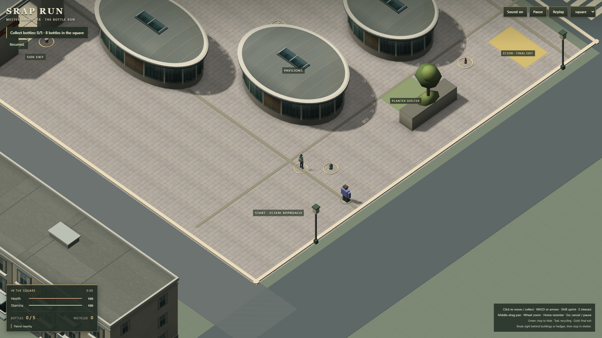
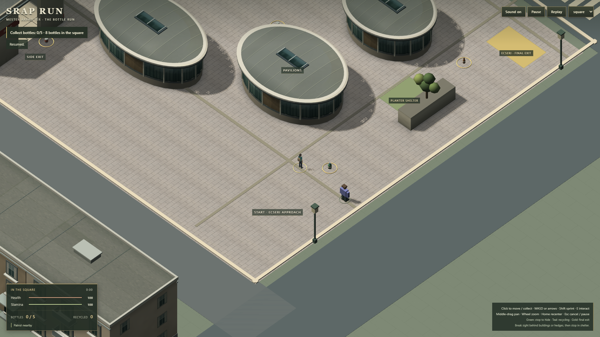

# G6 — environment density checkpoint

2026-09-22 · baseline **0e12136** · branch **codex/g3-production-art**.

**TECHNICAL: PASS · VISUAL: WEAK · PERFORMANCE: PASS.**

Two substantial screenshot-driven iterations completed. The span-64 gameplay
frame now has a clearer hierarchy from structures through planting and civic
furniture to actors/items, without changing mission, navigation, LOS, camera,
controls, item positions, cutaways or playable bounds.

The screenshot is materially closer to the density target, but remains visually
weak against the approved semi-realistic reference because foliage silhouette
and small-scale architectural specificity are still simplified.

## Visible result

| G5 before | G6 after |
| --- | --- |
|  |  |
|  |  |

[SRAP cutaway](art/g6/after-srap-cutaway.png) shows the added back-wall shelf
rhythm, restrained product blocks and recycling wayfinding treatment.

## Major visual changes

1. **Vegetation:** broad park-tree, narrow street-tree and layered shrub
   compositions use clustered opaque low-poly crowns, controlled three-value
   foliage and broken hedge rhythm. New planting stays inside existing solid
   planter/hedge footprints.
2. **Pavilions:** darker glazing/value modulation makes entrances and service
   bays more legible while retaining the existing exact ellipse geometry,
   triangle budget and cutaway ownership.
3. **Street furniture:** three bench/bin groups, an information board, bicycle
   stands and entry bollards break up long paving runs while staying clear of
   pickups, openings and patrol crossings.
4. **Background façades:** north/south/commercial shells now use different bay
   widths, balcony cadence, colour family and rooftop-unit placement.
5. **SRAP interior:** shallow back-wall shelving, limited product colour blocks
   and recycling signage add visible depth without new objectives or simulated
   stock interaction.

## Assets and provenance

[Source card](../assets-source/g6/README.md). All additions are original
code-authored geometry using existing project templates/material infrastructure.
No external or generated assets were introduced; existing public assets are
unchanged.

## Verification

- `npm run build`: production TypeScript/Vite build PASS; existing large-chunk
  warning remains.
- Focused unit checks: **6/6 PASS** (`architecture`, `art`, `slice-asset`).
- Production Chrome checks: **8/8 PASS** (`architecture`, `slice`, `m4`,
  `input-browser`, `world-depth`). These cover both SRAP openings, pavilion/SRAP
  cutaways, LOS, full alternate five-item mission, recycling, final exit, pause
  and replay.
- Final captures have no page errors. Final replay resources remain stable at
  259 meshes, 146 materials, two skeletons, six animation groups, one navmesh,
  one input adapter and one scene.

## Matched performance

Chrome 153 / Intel UHD ANGLE D3D11, headless 1920×1080 DPR1/span64; 4 s warm-up,
12 s per phase, alternating G5/G6 twice. Full raw results are in
[metrics.json](art/g6/metrics.json).

| Phase | G5 median repeats | G6 median repeats | G5 p95 repeats | G6 p95 repeats |
| --- | --- | --- | --- | --- |
| Idle | 9.8 / 9.8 | 9.8 / 9.8 | 12.2 / 12.3 | 12.4 / 12.0 |
| Walk | 9.7 / 9.7 | 9.7 / 9.7 | 12.1 / 12.2 | 12.2 / 12.1 |
| Sprint | 9.7 / 9.7 | 9.7 / 9.7 | 12.2 / 12.1 | 12.3 / 12.3 |
| Court | 9.5 / 9.5 | 9.5 / 9.5 | 12.2 / 12.1 | 12.1 / 11.9 |

Every timed segment recorded zero >100 ms stalls and zero dropped simulation
steps. No repeatable regression is present.

## Dominant remaining limitation

The vegetation still depends on stylised low-poly crown primitives, so its close
silhouette and branch structure remain less natural than the approved
semi-realistic target even though the span-64 composition is materially richer.
